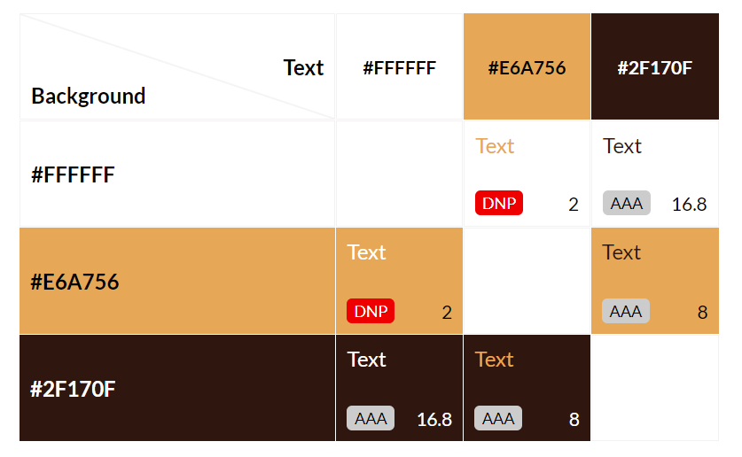

<h1 align="center">Reynolds Recipes Website</h1>


[View the live project here.](https://dave-reynolds-93.github.io/project-2/)

This is a recipe site with the aim of clients sharing recipes. It is aimed at people wanting to share there recipes and learn new ones. Features include information about the recipes, with full crud functionality for recipes and cuisine types. with easy navigation between pages.

## User Experience (UX)

-   ### User stories

    -   #### First Time Visitor Goals

        1. As a First Time Visitor, I want to easily understand the main purpose of the site and learn more about the recipes.
        2. As a First Time Visitor, I want to be able to easily navigate throughout the site to find content.

    -   #### Returning Visitor Goals

        1. As a Returning Visitor, I want to find new recipes, and add new ones.

    -   #### Frequent User Goals
    
        1. As a Frequent User, I want to find new recipes and add new ones.

-   ### Design
    -   #### Bootstrap Theme
        -   My original plan was to use a bootstrap theme. However, I couldn't get this to work with the version of Js I used. Instead of changing the version of Js, I stopped using the bootstrap theme, but kept a lot of the css styling that it gave me. I kept using the fonts and colour scheme that came from the theme.
    -   #### Colour Scheme
        -   The three main colours used are rgba(255, 255, 255, 0.7), #e6a756 and rgba(47, 23, 15, 0.9). The failures for the colour contrast are for the colours that don't interact on the website. All the colours that interact pass. 
    -   #### Typography
        -   Raleway and Lora are the 2 fonts used throughout the website, with many backups for both as the fallback font in case for any reason the fonts aren't being imported into the site correctly. The 2 fonts are very clean, and give the website a professional feel.
    -   #### Imagery
        -   N/A

*   ### Wireframes

    -   All wireframes - [View](/recipes/static/wireframes/wireframes.pdf)


## Features

-   Responsive on all device sizes

-   CRUD design for recipes and cuisines.

## Technologies Used

### Languages Used

-   [HTML5](https://en.wikipedia.org/wiki/HTML5)
-   [CSS3](https://en.wikipedia.org/wiki/Cascading_Style_Sheets)
-   [JavaScript](https://en.wikipedia.org/wiki/JavaScript)
-   [Python](https://en.wikipedia.org/wiki/Python_(programming_language))
-   [Flask](https://en.wikipedia.org/wiki/Flask_(web_framework))
-   [SQL Alchemy](https://en.wikipedia.org/wiki/Flask_(web_framework)))

### Frameworks, Libraries & Programs Used

1. [Bootstrap 5.3.3:](https://getbootstrap.com/docs/5.3/getting-started/introduction/)
    - Bootstrap was used to assist with the responsiveness and styling of the website.
1. [Google Fonts:](https://fonts.google.com/)
    - Google fonts were used to import the 'Lora' and 'Raleway' fonts into the style.css file which is used on all pages throughout the project.
1. [Git](https://git-scm.com/)
    - Git was used for version control by utilizing the Gitpod terminal to commit to Git and Push to GitHub.
1. [GitHub:](https://github.com/)
    - GitHub is used to store the projects code after being pushed from Git.
1. [Balsamiq:](https://balsamiq.com/)
    - Balsamiq was used to create the [wireframes](/recipes/static/wireframes/wireframes.pdf) during the design process.

## Testing

The W3C Markup Validator and W3C CSS Validator Services were used to validate every page of the project to ensure there were no syntax errors in the project. JsHint was used to validate the Javascript.

-   [W3C Markup Validator](https://jigsaw.w3.org/css-validator/#validate_by_input)
-   [W3C CSS Validator](https://jigsaw.w3.org/css-validator/#validate_by_input)
-   [JsHint](https://jshint.com/)

1.  base.html validated. Jinja errors and warnings.

2.  add_recipe.html validated. Jinja errors and warnings.

3.  add_cuisine.html validated. Jinja errors and warnings.

4.  edit_cuisine.html validated. Jinja errors and warnings.

5.  edit_recipe.html validated. Jinja errors and warnings.

6.  recipes.html validated. Jinja errors and warnings.

7.  cuisines.html validated. Jinja errors and warnings.

8.  Css validated. There were 5 warnings from external links and extensions.


### Testing User Stories from User Experience (UX) Section

-   #### First Time Visitor Goals

    1. As a First Time Visitor, I want to easily understand the main purpose of the site and learn more about the cuisines and recipes, and how to implement CRUD functionality for both.

        1. Upon entering the site, users are automatically greeted with a clean and easily readable navigation bar to go to the page of their choice.
        2. The user has two options, read what's on the homepage to see what recipes are already there, or click through to one of the other pages, to add a recipe or cuisine to the site.

    2. As a First Time Visitor, I want to be able to easily be able to navigate throughout the site to find content.

        1. The site has been designed to be fluid and never to entrap the user. At the top of each page there is a clean navigation bar, each link describes the page they will end up at clearly.

-   #### Returning Visitor Goals

    1. As a Returning Visitor, I want to be able to create, read, update and delete recipes and cuisines.

        1. The navigation bar clearly highlights the different pages.

-   #### Frequent User Goals

    1. As a Frequent User, I want to be able to create, read, update and delete recipes and cuisines.

        1. The navigation bar clearly highlights the different pages.

### Further Testing

-   The Website was tested on Google Chrome, Internet Explorer, Microsoft Edge and Safari browsers.
-   The website was viewed on a variety of devices such as Desktop, Laptop, iPhone7, iPhone 8 & iPhoneX.
-   A large amount of testing was done to ensure that all pages were linking correctly.
-   Friends and family members were asked to review the site and documentation to point out any bugs and/or user experience issues.

### Known Bugs

-   Duration field currently accepts negative integers.
-   Haven't implemented adding ingredients to the recipes.
-   The date in the footer is not dynamically added.
-   Whitespace at bottom of some of the pages on some device sizes.
-   When there are no recipes, it still says here are the recipes. Same for cuisine page.
-   Reynolds Recipes in the nav link isn't working.
-   Recipe description text area won't allow typing longer than 2 lines.


### Bugs that were fixed

-   I tried to use a bootstrap theme, but the version of the css in the theme was different to the bootstrap js cdn version included at the bottom of my template. This caused it to not work, so I ended up not using a theme at all, and using my own bootstrap styling. 

### Screenshots

1. Recipes page desktop and mobile.  

Desktop

Desktop Accordion Expanded

Mobile

Mobile Accordion Expanded


2. Cuisines page desktop and mobile  
Desktop

Mobile


3. Add/Edit recipe page desktop and mobile  

Desktop

Mobile


4. Add/Edit cuisine page desktop and mobile  

Desktop

Mobile


5. Footer desktop and mobile


6. Header desktop and mobile


## Deployment

### GitHub Pages

The project was deployed to GitHub Pages using the following steps...

1. Log in to GitHub and locate the [GitHub Repository](https://github.com/dave-reynolds-93/project-2)
2. At the top of the Repository (not top of page), locate the "Settings" Button on the menu.
3. Scroll down the Settings page until you locate the "GitHub Pages" Section.
4. Under "Source", click the dropdown called "None" and select "Master Branch".
5. The page will automatically refresh.
6. Scroll back down through the page to locate the now published site [link](https://github.com/dave-reynolds-93/project-2/settings/pages) in the "GitHub Pages" section.

### Forking the GitHub Repository

By forking the GitHub Repository we make a copy of the original repository on our GitHub account to view and/or make changes without affecting the original repository by using the following steps...

1. Log in to GitHub and locate the [GitHub Repository](https://github.com/dave-reynolds-93/project-2)
2. At the top of the Repository (not top of page) just above the "Settings" Button on the menu, locate the "Fork" Button.
3. You should now have a copy of the original repository in your GitHub account.

### Making a Local Clone

1. Log in to GitHub and locate the [GitHub Repository](https://github.com/dave-reynolds-93/project-2)
2. Under the repository name, click "Clone or download".
3. To clone the repository using HTTPS, under "Clone with HTTPS", copy the link.
4. Open Git Bash
5. Change the current working directory to the location where you want the cloned directory to be made.
6. Type `git clone`, and then paste the URL you copied in Step 3.

```
$ git clone https://github.com/dave-reynolds-93/project-2
```

7. Press Enter. Your local clone will be created.

```
$ git clone https://github.com/dave-reynolds-93/project-2
> Cloning into `CI-Clone`...
> remote: Counting objects: 10, done.
> remote: Compressing objects: 100% (8/8), done.
> remove: Total 10 (delta 1), reused 10 (delta 1)
> Unpacking objects: 100% (10/10), done.
```

Click [Here](https://help.github.com/en/github/creating-cloning-and-archiving-repositories/cloning-a-repository#cloning-a-repository-to-github-desktop) to retrieve pictures for some of the buttons and more detailed explanations of the above process.

## Credits

### Code

-   [Bootstrap 5.3.2](https://getbootstrap.com/docs/4.4/getting-started/introduction/): Bootstrap Library used throughout the project mainly to make site responsive using the Bootstrap Grid System, navbar and also for styling.


### Content

-   All content was written by the developer.

### Media

-   The massage image was found on pexel, a free image database.

### Acknowledgements

-   My Mentor for continuous helpful feedback.

-   Tutor support at Code Institute for their support.